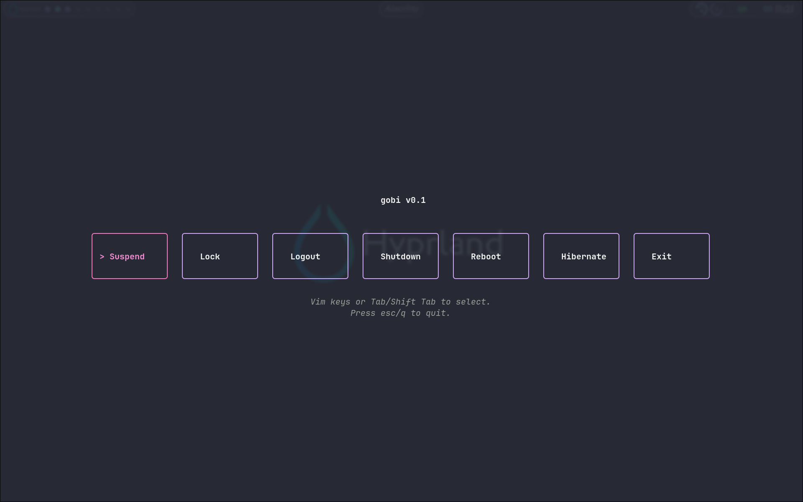

# gobi v0.1

Simple _TUI_ based logout prompt written in Go using the
[bubbletea](https://github.com/charmbracelet/bubbletea) library.  This repo is
meant more as a template but if you're using Hyprland and the Hypr Ecosystem
_ie. Hyprlock_ the default commands do not need to be changed.

If you're not using [Hyprland](https://github.com/hyprwm/Hyprland) or would like
to change the default commands please see the comments in the `main.go` file
it's fairly self-explanatory and with the included comments you shouldn't have
a problem figuring it but if you have any questions please feel free to ask.

## Building

After changing the default commands or colors in the `main.go` file you can use
the `go run main.go` command to test your changes and then use
`go build -o gobi main.go` to build the binary.  Then either move your _gobi_ to
somewhere in your path or setup the __GOBIN__ environmental variable and add it
to your __PATH__.

## Hyprland Configuration

Below is the _windowrule_ and _bind_ I use to call __gobi__.

### windowrule
`windowrule = fullscreen,class:gobi`

### bind
_Change_ __\$TERMINAL__ _to your default terminal client if you don't have the_
__TERMINAL__ _environmental variable set._
`bind = $mainMod, Q, exec, $TERMINAL --class "gobi" -e /path/to/gobi`

## Screenshot

